# adx-explorer
Note that this project is for POC purposes only.  Please see DISCLAIMER.md for more details

This Sample Code is provided for the purpose of illustration only and is not intended to be used in a production environment.
THIS SAMPLE CODE AND ANY RELATED INFORMATION ARE PROVIDED "AS IS" WITHOUT WARRANTY OF ANY KIND, 
EITHER EXPRESSED OR IMPLIED, INCLUDING BUT NOT LIMITED TO THE IMPLIED WARRANTIES OF MERCHANTABILITY 
AND/OR FITNESS FOR A PARTICULAR PURPOSE.  We grant You a nonexclusive, royalty-free right to use and 
modify the Sample Code and to reproduce and distribute the object code form of the Sample Code, provided that 
You agree: (i) to not use Our name, logo, or trademarks to market Your software product in which the Sample Code
is embedded; (ii) to include a valid copyright notice on Your software product in which the Sample Code is embedded;
and (iii) to indemnify, hold harmless, and defend Us and Our suppliers from and against any claims or lawsuits, 
including attorneys’ fees, that arise or result from the use or distribution of the Sample Code.

Examples for working with ADX

## Table of Contents

- [Introduction](#introduction)
- [Features](#features)
- [Installation](#installation)
- [Usage](#usage)
- [Contributing](#contributing)
- [License](#license)

## Introduction

Sample codebase for working with ADX

## Features

- **Event Grid Ingestion**: Easily setup an event grid subscription to automatically ingest data into an ADX table

## Steps

Navigate to Portal.azure.com and launch cloud portal

Ensure you are in bash
Git clone github file
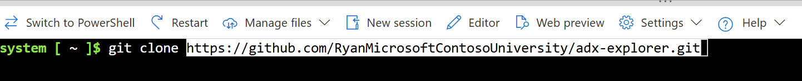

Change RESOURCE_GROUP in create-event-grid.infra.sh file
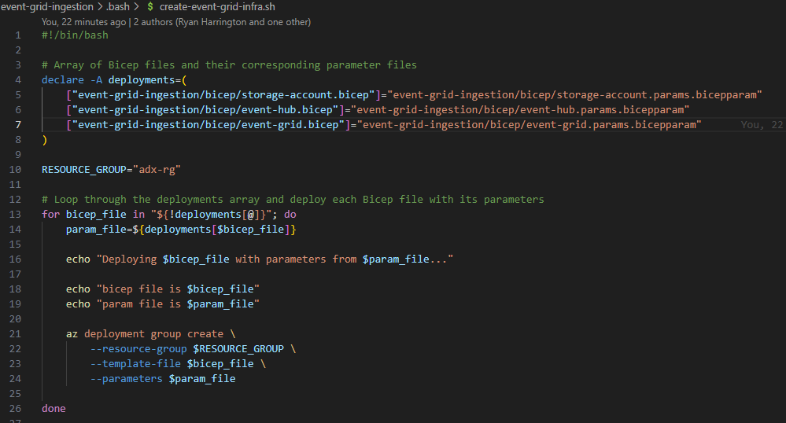

Adjust parameter names in bicepparam files to desired values

Change permissions for cloud shell to allow script to be run
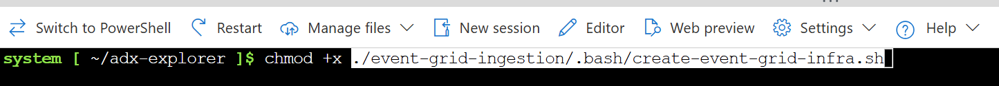

From root, run ./event-grid-ingestion/.bash/create-event-grid-infra.sh
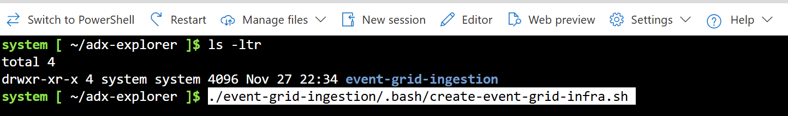

Deployment in Progress
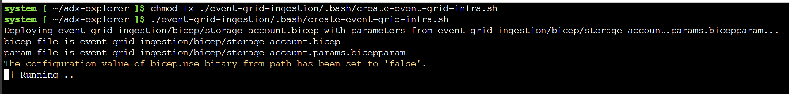

Post Deployment Results
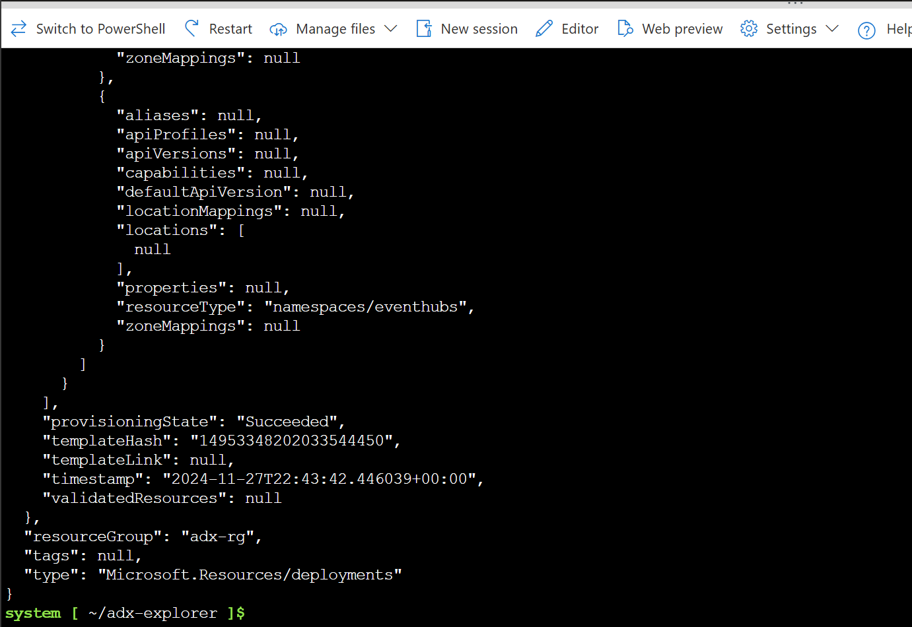

## Create Data Connection for Event Grid
Create a new ADX table, this can be done either via the UI or using the script in this repo (as an example)

In your ADX Database, create a new data connection for the Event Grid created earlier
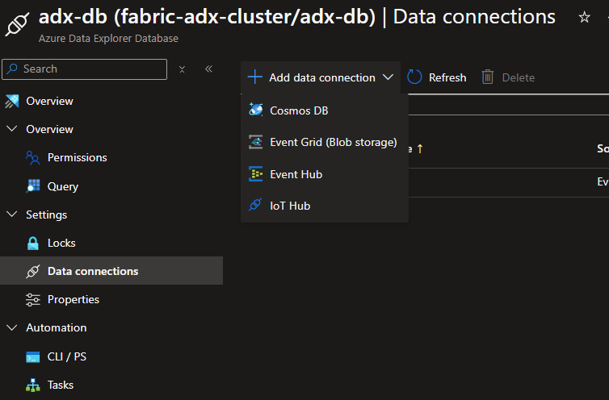
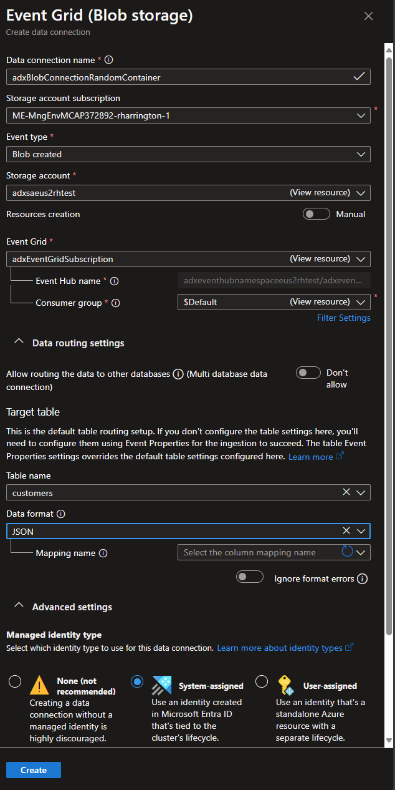

Missed from the earlier screenshot, be sure to add the correct mapping file as well
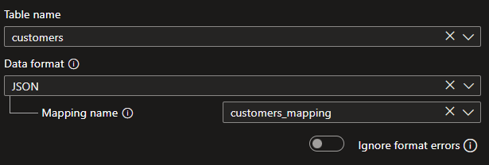

Upload the second file and the Event Grid should load the data for the ADX DB
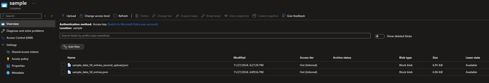

Wait five minutes and you should see traffic against the event hub
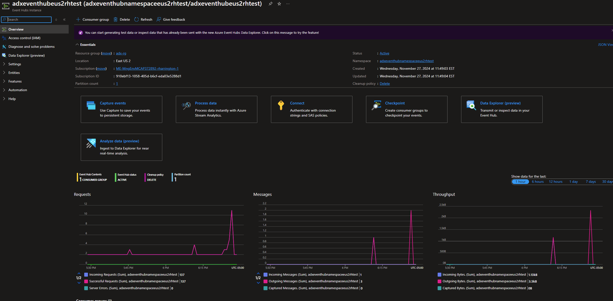

Check the table you created and you should see more data in the table now
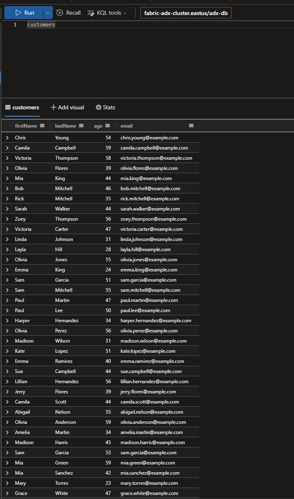
